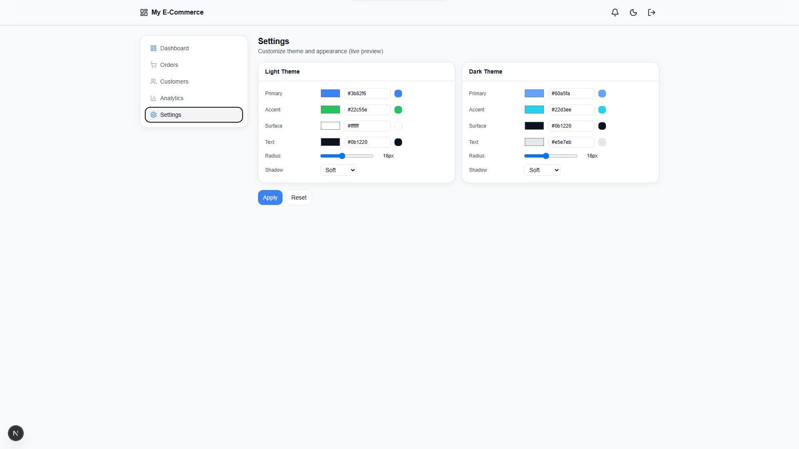
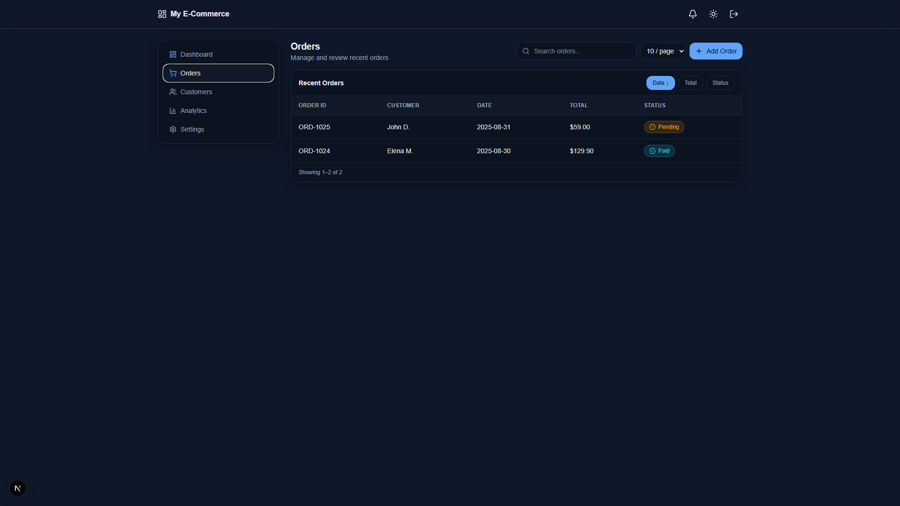
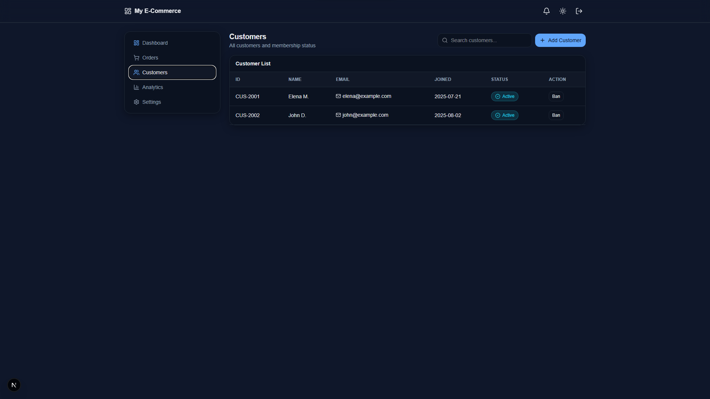
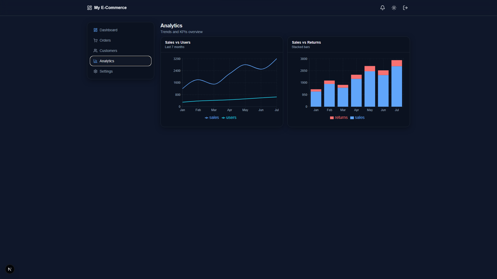
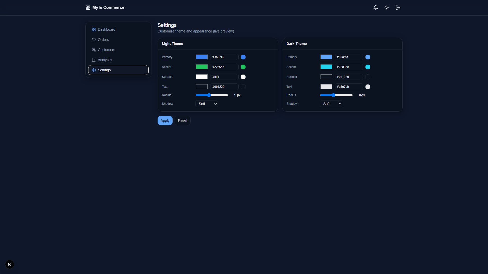
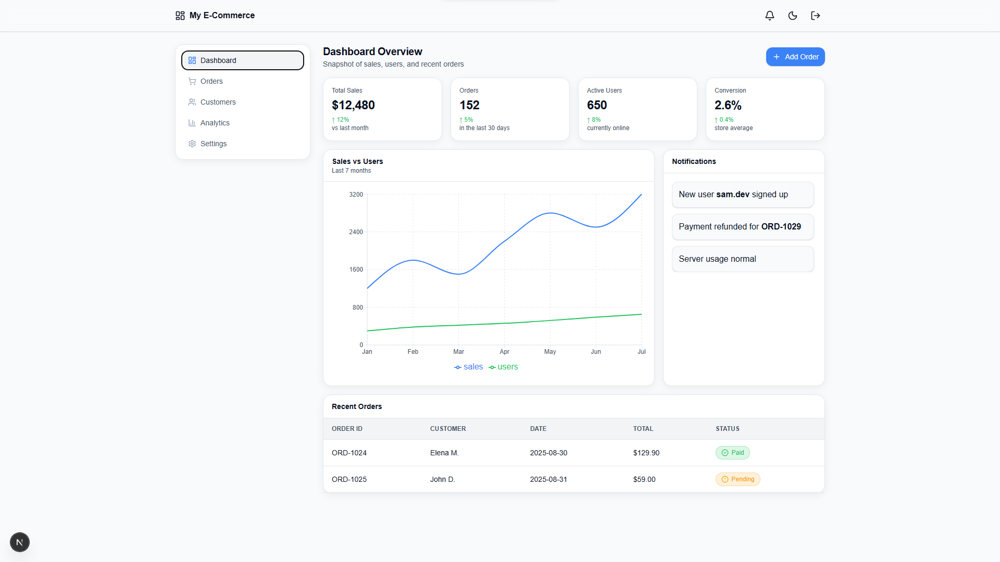
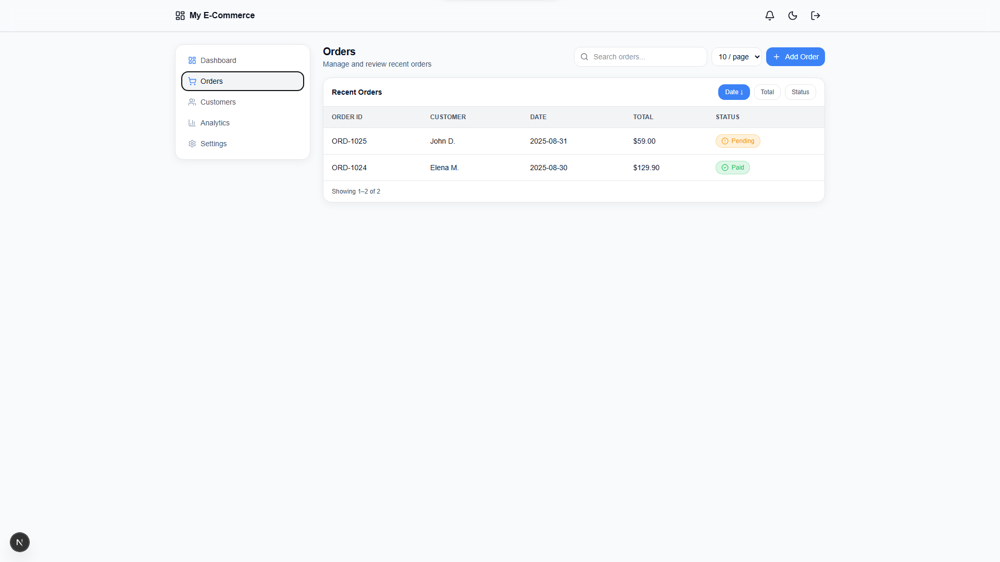
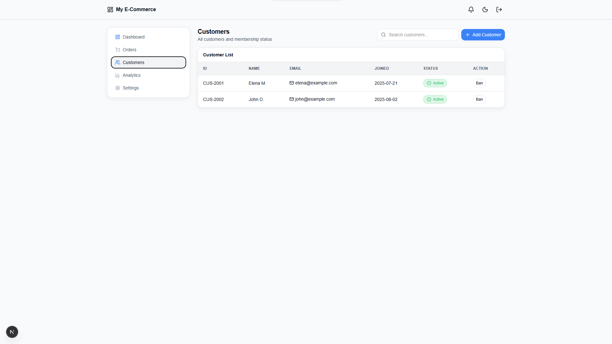
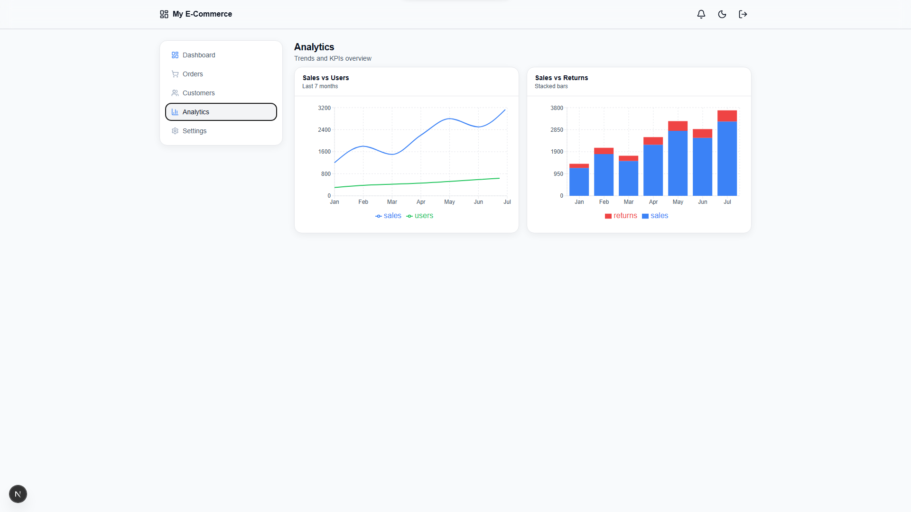

🌟 Yousef Admin Panel
A modern Next.js + Tailwind v4 admin panel built with framer-motion, recharts, and lucide-react.  
Fully responsive, themeable, and ready-to-use as a single component.

📌 Version
v1 – Initial stable release 🚀

✨ Features
🌗 Light/Dark mode toggle  

🎨 Theme customization (primary, accent, radius, shadow, etc.)  

📊 Analytics charts with Recharts (Line & Bar)  

📑 Orders management: search, sort, add order, empty state  

👥 Customers management: add, search, ban/unban  

🔔 Notifications feed  

🎯 KPI cards (Sales, Orders, Users, Conversion)  

⚡ Animated sidebar with Lucide icons  

📱 Responsive design (desktop & mobile)  

🪄 Smooth animations powered by framer-motion  

🛠 Tech Stack
Next.js 15 (App Router)  

Tailwind CSS v4  

Framer Motion  

Recharts  

Lucide React  

📦 Installation
Clone the repo and install dependencies:

git clone [https://github.com/](https://github.com/)  <your-user>/<repo-name>.git
cd <repo-name>

npm install
# or
yarn install
# or
pnpm install

Required packages:

npm i framer-motion lucide-react recharts

🚀 Usage
Simply import the component into your Next.js app:

"use client";
import AdminPanel from "@/components/AdminPanel";

export default function Page() {
  return <AdminPanel title="Yousef Admin" />;
}

That’s it! 🎉  
The panel comes with Dashboard, Orders, Customers, Analytics, and Settings out of the box.

🎨 Theming
Navigate to the Settings tab  

Change colors, shadows, and radius with live preview  

Switch between light/dark mode anytime  

Default themes are defined in:  
  - defaultLightTheme  
  - defaultDarkTheme  

📸 Screenshots

🚀 Deployment
Deploy easily with Vercel:  

vercel

Or connect your GitHub repo directly.

📝 License
MIT

🤝 Contributing
Pull requests are welcome!  
Follow conventional commits (feat:, fix:, chore:) when contributing.

💡 Author
Made with ❤️ by Yousef